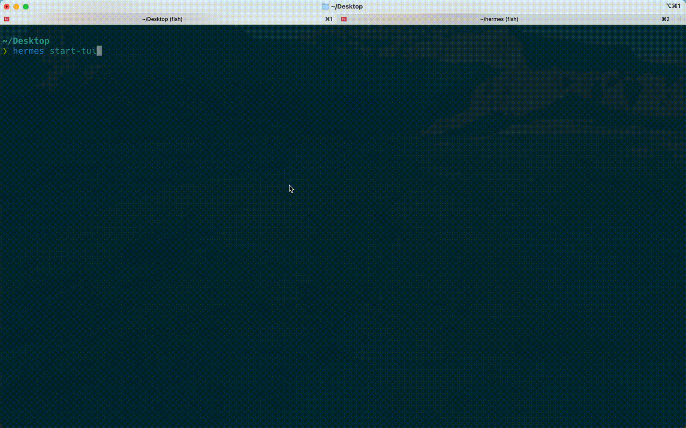

# Hermes

**Hermes** 是你的郵件小助手，提供了一個帶有 TUI 介面的 CLI SMTP 客戶端。無論是簡單的 CLI 命令還是互動式 TUI 介面，它都能幫助你輕鬆發送電子郵件，讓你瞬間成為電子郵件界的信使之神！👈 AI 真會唬爛

---

## 功能特點

- **CLI 模式**：快速發送電子郵件，無需圖形介面。
- **TUI 模式**：提供互動式的文字用戶界面，讓你更直觀地操作發送郵件流程。
- **多選項配置**：支援從命令行傳遞發件人、收件人、主題等詳細信息。
- **輕鬆發送**：可配置 SMTP 主機與端口，支援不同郵件伺服器。
- **爆發模式**：併發多協程(goroutine)發信，適用於壓力測試與填充數據使用。

---

## 安裝

在本地安裝 Hermes 並開始使用：
```shell
go get -u github.com/wtg42/hermes

go install
```

---

## 使用 make（可選）

若已安裝 `make`，可使用以下常用指令：

```bash
make build   # 編譯輸出至 bin/hermes
make test    # 跑測試（含 -race 與覆蓋率）
make lint    # go vet 與 go fmt
make run     # 執行 TUI：等同 go run . start-tui
make clean   # 刪除 bin/
```

---

## 開發與測試

### 集成測試

本項目使用 **Mailpit** 作為郵件服務器來進行集成測試。Mailpit 提供了一個輕量級的 SMTP 伺服器，用於捕獲和檢查發送的郵件。

#### 運行測試

執行以下命令運行所有測試（包括集成測試）：

```bash
make test
```

#### 測試流程

1. **啟動 Mailpit 容器**：Makefile 自動檢查 Docker 可用性，並通過 Docker Compose 啟動 Mailpit 容器
2. **檢查 API 可用性**：等待 Mailpit REST API 在 `http://127.0.0.1:8025/api/v1` 上可用
3. **執行測試**：運行 Go 測試套件（包括所有集成測試）
4. **驗證郵件內容**：集成測試通過 Mailpit API 驗證：
   - 郵件主題、發件人和收件人
   - 郵件正文內容和字符編碼（包括中文支援）
   - MIME 結構和附件
   - 爆發模式下的大量郵件發送
5. **清理環境**：測試完成後，Makefile 自動清理 Mailpit 容器

#### Mailpit API 功能

集成測試利用 Mailpit 提供的 REST API 來驗證郵件內容：

- `GET /api/v1/messages` - 列出所有接收到的郵件
- `GET /api/v1/message/latest` - 獲取最新的郵件
- `GET /api/v1/message/{ID}/raw` - 獲取郵件的原始格式（包含完整的 MIME 結構）

#### 系統要求

- **Docker**：集成測試需要 Docker 運行環境。如果 Docker 不可用，測試會顯示清晰的錯誤信息
- **curl**：Makefile 使用 curl 檢查 Mailpit API 可用性

#### 測試覆蓋

- `sendmail` 包：73% 代碼覆蓋率
  - 郵件內容驗證測試
  - 字符編碼測試（中文支援）
  - 附件處理測試
  - MIME 結構驗證
  - 爆發模式測試

---

## 使用說明

### Burst 模式

爆發模式發送郵件，一次併發大量郵件發送模式。

```bash
hermes burst [flags]
```

#### 範例

爆發模式發送郵件：

```bash
hermes burst --quantity="1000" --host=smtp.gmail.com" --port="587"
```

---

#### 可用參數

| 參數               | 描述                                         |
|--------------------|----------------------------------------------|
| `--host`           | MTA 主機名稱（例如：`smtp.gmail.com`）         |
| `--port`           | 端口號（例如：`25`）                          |
| `--quantity`       | 要發送的郵件數量                              |
| `--domain`         | 收件人域名（可多個，以逗號分隔）               |
| `-h`, `--help`     | 查看幫助                                     |

---

### TUI 模式

啟動互動式文字用戶界面，適合需要介面操作發送郵件的用戶。

```bash
hermes start-tui
# 或
hermes start-tui [flags]
```

#### 可用參數

| 參數             | 描述     |
|------------------|----------|
| `-h`, `--help`   | 查看幫助 |

#### TUI 熱鍵

在自訂郵件內容發送模式中，您可以使用以下熱鍵快速插入郵件範本：

| 熱鍵          | 描述                     |
|---------------|--------------------------|
| `Ctrl+H`     | 插入 HTML 郵件範本       |
| `Ctrl+T`     | 插入純文字郵件範本       |
| `Ctrl+E`     | 插入 EML 格式範本        |
| `Tab`        | 切換焦點                 |
| `Esc`        | 返回上一頁               |
| `Ctrl+C`     | 退出程式                 |

---

## 示例


