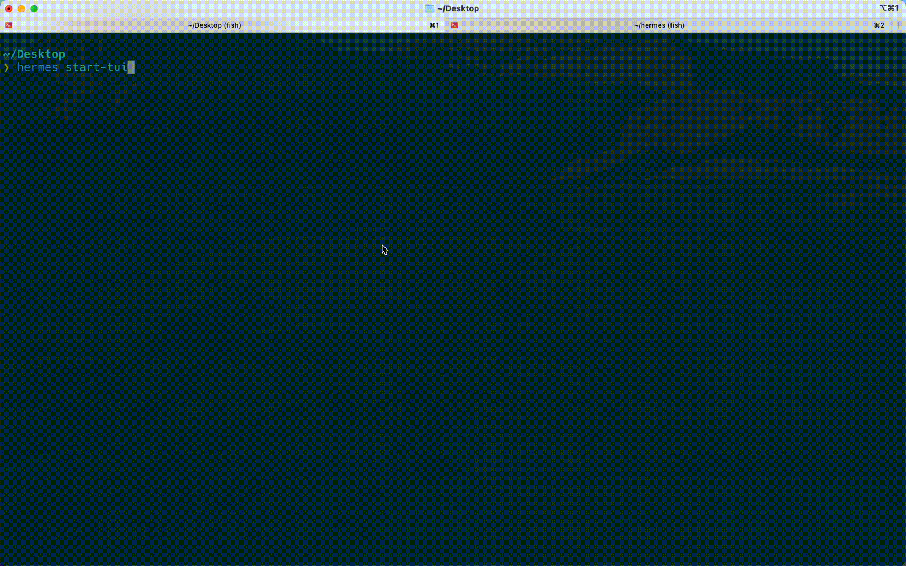

# Hermes

**Hermes** 是你的郵件小助手，提供了一個帶有 TUI 介面的 CLI SMTP 客戶端。無論是簡單的 CLI 命令還是互動式 TUI 介面，它都能幫助你輕鬆發送電子郵件，讓你瞬間成為電子郵件界的信使之神！👈 AI 真會唬爛

---

## 功能特點

- **CLI 模式**：快速發送電子郵件，無需圖形介面。
- **TUI 模式**：提供互動式的文字用戶界面，讓你更直觀地操作發送郵件流程。
- **多選項配置**：支援從命令行傳遞發件人、收件人、主題等詳細信息。
- **輕鬆發送**：可配置 SMTP 主機與端口，支援不同郵件伺服器。
- **爆發模式**：併發多協程(goroutine)發信，適用於壓力測試與填充數據使用。

---

## 安裝

在本地安裝 Hermes 並開始使用：
```shell
go get -u github.com/wtg42/hermes

go install
```

---

## 使用 make（可選）

若已安裝 `make`，可使用以下常用指令：

```bash
make build   # 編譯輸出至 bin/hermes
make test    # 啟動 Mailpit 後跑測試（含 -race、覆蓋率與 integration tag）
make lint    # go vet 與 go fmt
make run     # 執行程式：等同 go run .
make clean   # 刪除 bin/
```

---

## 開發與測試

### 集成測試

本項目使用 **Mailpit** 作為郵件服務器來進行集成測試。Mailpit 提供了一個輕量級的 SMTP 伺服器，用於捕獲和檢查發送的郵件。

#### 運行測試

執行以下命令運行所有測試（包括集成測試）：

```bash
make test
```

#### 測試流程

1. **檢查 Docker 可用性**：Makefile 會先執行 `docker ps`；若不可用會直接報錯並結束
2. **啟動 Mailpit 容器**：透過 `docker-compose down && docker-compose up -d` 啟動/重建 Mailpit
3. **檢查 API 可用性**：最多重試 5 次，使用 `curl` 檢查 `http://127.0.0.1:8025/api/v1/messages`
4. **執行測試**：運行 `go test ./... -race -cover -tags integration`
5. **驗證郵件內容**：集成測試通過 Mailpit API 驗證：
   - 郵件主題、發件人和收件人
   - 郵件正文內容和字符編碼（包括中文支援）
   - MIME 結構和附件
   - 爆發模式下的大量郵件發送
6. **清理環境**：測試完成後，Makefile 自動執行 `docker-compose down`

#### Mailpit API 功能

集成測試利用 Mailpit 提供的 REST API 來驗證郵件內容：

- `GET /api/v1/messages` - 列出所有接收到的郵件
- `GET /api/v1/message/latest` - 獲取最新的郵件
- `GET /api/v1/message/{ID}/raw` - 獲取郵件的原始格式（包含完整的 MIME 結構）

#### 系統要求

- **Docker**：`make test` 會使用 `docker` 指令檢查可用性，若不可用會直接失敗
- **docker-compose**：`make test` 透過 `docker-compose` 啟動與清理 Mailpit 容器
- **curl**：`make test` 使用 `curl` 輪詢 Mailpit API 是否可用

#### 測試覆蓋

- `sendmail` 包：73% 代碼覆蓋率
  - 郵件內容驗證測試
  - 字符編碼測試（中文支援）
  - 附件處理測試
  - MIME 結構驗證
  - 爆發模式測試

---

## 使用說明

### Structured Send 模式

`hermes send` 適合 script 或 agent 以明確參數發送單封測試信，不會啟動 TUI。`--server` 必須明確指定 dotted IPv4；hostname、`localhost`、IPv6、環境變數或隱含預設主機都不會被接受。

最小安全範例：

```bash
hermes send --server 192.0.2.10
```

未指定時會採用以下安全預設：SMTP port 為 `25`、From 為 `weitingshih@rd01.softnext.com.tw`、To 為另一個正向表列地址，Subject 與 Body 則產生包含中英文、emoji、台北時間與 Trace-ID 的測試內容。

完整範例：

```bash
hermes send --server 127.0.0.1 --port 1025 \
  --from sender@example.com \
  --to to1@example.com,to2@example.com --to to3@example.com \
  --cc cc@example.com --bcc bcc@example.com \
  --subject 'Hermes 中文測試 📨' --body '自訂內容不會被改寫' \
  --attach ./first.txt --attach ./second.json \
  --confirm-outside-whitelist
```

To、CC、BCC 與附件都可重複指定或以逗號分隔，輸入順序會保留；重複附件路徑只附加一次。所有附件會在 SMTP 連線前完整驗證，只要任一路徑不存在、不可讀或 MIME 處理失敗，整封信就不會寄出。

安全正向表列如下：

- From：`weitingshih@rd01.softnext.com.tw`、`jllee@rd01.softnext.com.tw`、`adam@rd01.softnext.com.tw`
- To／CC／BCC 網域：精確的 `rd01.softnext.com.tw`（不包含子網域）
- SMTP port：`25`

任一值超出正向表列時，必須加上 `--confirm-outside-whitelist` 作為本次執行的明確授權。錯誤訊息會一次列出所有越界原因。這個旗標不能略過 IPv4、Email、port 範圍或附件驗證，也不代表支援 SMTP Auth/TLS；送出前請再次確認外部收件者是否真的是測試信箱。

| 參數 | 描述 |
|---|---|
| `--server` | 必填；SMTP server 的 dotted IPv4 |
| `--port` | SMTP port，預設 `25` |
| `--from` | 寄件者；省略時使用安全預設 |
| `--to` | To，可重複或逗號分隔；省略時使用與 From 不同的安全地址 |
| `--cc` | CC，可重複或逗號分隔 |
| `--bcc` | BCC，可重複或逗號分隔；只放入 SMTP envelope |
| `--subject` | 主旨；省略時產生隨機測試主旨 |
| `--body` | 內文；省略時產生隨機測試內文 |
| `--attach` | 附件路徑，可重複或逗號分隔 |
| `--confirm-outside-whitelist` | 明確授權本次白名單外的 sender、recipient 或 port |

### Burst 模式

Burst 模式會併發發送大量測試郵件。From 與 To 可各自指定固定地址；未指定的欄位會從 `--domain` 產生隨機地址。

```bash
hermes burst [flags]
```

> **Breaking change：** 隨機地址不再使用隱含網域。只要 From 或 To 任一欄未指定，就必須明確提供 `--domain`，否則整批郵件不會送出。

#### 地址模式範例

From、To 都隨機：

```bash
hermes burst --quantity 1000 --host smtp-test.example --port 25 \
  --domain rd01.softnext.com.tw
```

From 固定、To 隨機：

```bash
hermes burst --quantity 1000 --host smtp-test.example --port 25 \
  --from sender@rd01.softnext.com.tw \
  --domain rd01.softnext.com.tw
```

From 隨機、To 固定：

```bash
hermes burst --quantity 1000 --host smtp-test.example --port 25 \
  --to recipient@rd01.softnext.com.tw \
  --domain rd01.softnext.com.tw
```

From、To 都固定時不需要 `--domain`：

```bash
hermes burst --quantity 1000 --host smtp-test.example --port 25 \
  --from sender@rd01.softnext.com.tw \
  --to recipient@rd01.softnext.com.tw
```

#### 網域安全機制

Burst mode 內建的安全網域正向表列只有 `rd01.softnext.com.tw`。固定 From、固定 To 與隨機 `--domain` 使用的其他網域，都必須透過可重複的 `--allow-domain` 逐一明確授權。

例如，以下命令明確授權本次執行寄往 Gmail：

```bash
hermes burst --quantity 10 --host smtp-test.example --port 25 \
  --from sender@rd01.softnext.com.tw \
  --to recipient@gmail.com \
  --allow-domain gmail.com
```

`--allow-domain` 只代表使用者已確認該網域可接受本次大量寄信。授權採不分大小寫的精確比對；授權父網域不會自動授權子網域。任何地址、網域或授權驗證失敗時，系統會在啟動寄信 goroutine 前整批拒絕，不會先寄出部分郵件。

#### 可用參數

| 參數 | 描述 |
|---|---|
| `--host` | 必填；MTA 主機名稱 |
| `--port` | 必填；SMTP port（例如 `25`） |
| `--quantity` | 必填；要發送的郵件數量 |
| `--from` | 固定寄件人；未提供時隨機產生 |
| `--to` | 固定收件人；未提供時隨機產生 |
| `--domain` | 未指定 From 或 To 時必填；隨機地址網域，可重複或以逗號分隔 |
| `--allow-domain` | 明確授權非表列網域，只限本次執行，可重複 |
| `-h`, `--help` | 查看幫助 |

---

### TUI 模式

啟動互動式文字用戶界面，適合需要介面操作發送郵件的用戶。

```bash
hermes
```

TUI 單封寄信與 `hermes send` 共用下列安全正向表列：

- From：`weitingshih@rd01.softnext.com.tw`、`jllee@rd01.softnext.com.tw`、`adam@rd01.softnext.com.tw`
- To／CC／BCC 網域：精確的 `rd01.softnext.com.tw`（不包含子網域）
- SMTP port：`25`

全部符合正向表列時，`Ctrl+S` 會直接寄送；任一項超出時，TUI 會列出全部原因，必須輸入精確的大寫 `SEND` 並按 Enter，才會授權該封郵件。按 Esc 可取消確認並保留草稿。這項授權只適用於當下顯示的 From、To／CC／BCC、Subject、Body、Host、Port 與附件快照，不會持久保存或套用到下一封郵件；郵件內容若有變更，必須重新檢查與確認。

格式錯誤的 Email、無效 port 或附件讀取失敗仍會拒絕寄送，輸入 `SEND` 不能略過這些驗證。TUI 延續既有行為，可在 Host 欄使用 hostname；自動化的 `hermes send` 仍只接受明確的 dotted IPv4。

#### 可用參數

| 參數             | 描述     |
|------------------|----------|
| `-h`, `--help`   | 查看幫助 |

#### TUI 熱鍵

Compose TUI 將高頻操作保留為直接快捷鍵，其他功能透過 `Ctrl+X` 開啟 Command HUD。

| 直接熱鍵        | 描述                         |
|-----------------|------------------------------|
| `Ctrl+S`        | 寄送；越界時進入安全確認     |
| `Ctrl+X`        | 開啟 Command HUD             |
| `Ctrl+J`        | 從 Header 切換到 Composer    |
| `Ctrl+K`        | 從 Composer 切換回 Header    |
| `Tab`           | 下一個 Header 欄位           |
| `Shift+Tab`     | 上一個 Header 欄位           |
| `Esc`           | 取消目前操作或返回上一層     |

按下 `Ctrl+X` 後，可接著使用：

| Prefix sequence | 描述                         |
|-----------------|------------------------------|
| `Ctrl+X`, `a`   | 選擇附件                     |
| `Ctrl+X`, `t`   | 開啟 HTML／純文字／EML 範本選單 |
| `Ctrl+X`, `c`   | 清除 Compose；有內容時需再次按 `c` |
| `Ctrl+X`, `q`   | 結束程式；有內容時需再次按 `q` |
| `Ctrl+X`, `?`   | 顯示完整快捷鍵說明           |

舊的 `Ctrl+A`、`Ctrl+H`、`Ctrl+T`、`Ctrl+E`、`Ctrl+C` 與 Esc 清除／退出操作已移除；狀態列會依目前的 Command、Template 或確認狀態顯示下一個可用按鍵。

---

## 示例


